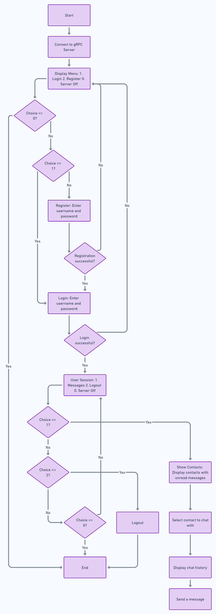

# Messaging Application - gRPC Service

## Overview
This is a Go-based messaging application that uses gRPC for communication between the client and server. The application allows users to register, log in, and exchange messages with other users. It provides a simple and efficient framework to manage user authentication and messaging features.

## Key Features

### User Registration and Login:
- New users can register with a unique username and password.
- Registered users can log in to their accounts.
- Upon successful login, users are directed to the messaging interface.

### Messaging Service:
- View contacts with unread messages.
- Read message history with a selected contact.
- Send new messages to the selected contact.

### Session Management:
Logged-in users can:
- View and send messages.
- Log out of the application.
- Shut down the server.

## Flowchart Available:
A detailed flowchart explaining the application’s flow and logic is available in the project folder (`flowchart.png`).

## Project Flow (Based on Flowchart)
1. **Start the Application**: The client connects to the gRPC server running on localhost:50051.
2. **Main Menu**: Users can:
   - Register (Option 2).
   - Log in (Option 1).
   - Shut down the server (Option 0).
3. **Registration**: Users enter their username and password to register. After successful registration, users are logged in automatically.
4. **Login**: Users enter their credentials to log in. If login is successful, the user enters the messaging interface.
5. **Messaging Interface**: Users can:
   - View contacts with unread messages.
   - Select a contact to view the chat history.
   - Send a message to the selected contact.
6. **Logout/Shutdown**: Users can log out and return to the main menu. The server can be shut down through the menu by choosing the relevant option.

## Project Structure
```bash
├── client/
│   ├── main.go               # Client-side logic (registration, login, messaging).
├── server/
│   ├── main.go               # Server-side logic (handling gRPC services).
├── proto/
│   ├── auth.proto            # Protobuf definitions for authentication service.
│   ├── message.proto         # Protobuf definitions for messaging service.
├── db/
│   ├── db.go                 # Database connection setup.
├── flowchart.png             # Flowchart illustrating the application's flow.
└── README.md                 # Project documentation.
```
# Messaging Application - gRPC Service

## gRPC Services

### Authentication Service (AuthService):
- **Register**: Registers a new user in the system.
- **Login**: Authenticates an existing user based on their credentials.

### Message Service (MessageService):
- **ListContacts**: Retrieves the user's contact list showing unread messages.
- **ReadMessages**: Fetches chat history with a selected contact.
- **SendMessage**: Allows the user to send messages to a selected contact.

## Prerequisites
- **Go** (v1.19+)
- **gRPC** (Go gRPC libraries)
- **MySQL** (Database for user and message storage)
- **Protobuf Compiler** (for generating Go files from .proto definitions)

## Installation

1. **Clone the repository**:
    ```bash
    git clone <repository-url>
    cd messaging-application
    ```

2. **Install dependencies**:
    ```bash
    go mod tidy
    ```

3. **Set up the database**:
   - Ensure MySQL is running.
   - Create a database for storing users and messages.
   - Update the database connection details in `db/db.go`.

4. **Generate gRPC code from .proto files**:
    ```bash
    protoc --go_out=. --go-grpc_out=. proto/*.proto
    ```

5. **Run the server**:
    ```bash
    go run server/main.go
    ```

6. **Run the client**:
    ```bash
    go run client/main.go
    ```

## Usage
- **Launch the server and client**:
  - Start the server using `go run server/main.go`.
  - Start the client using `go run client/main.go`.

- **Interact with the application**:
  - From the main menu, register, log in, or shut down the server.
  - Once logged in, view contacts, read message history, and send messages.

## Technologies Used
- **Go**: Backend logic for client and server.
- **gRPC**: Client-server communication framework.
- **MySQL**: Database for storing users and messages.
- **Protobuf**: Defines the structure of data transmitted between client and server.

## Additional Resources
The project flowchart provides a visual representation of the user flow and interaction in the application.


